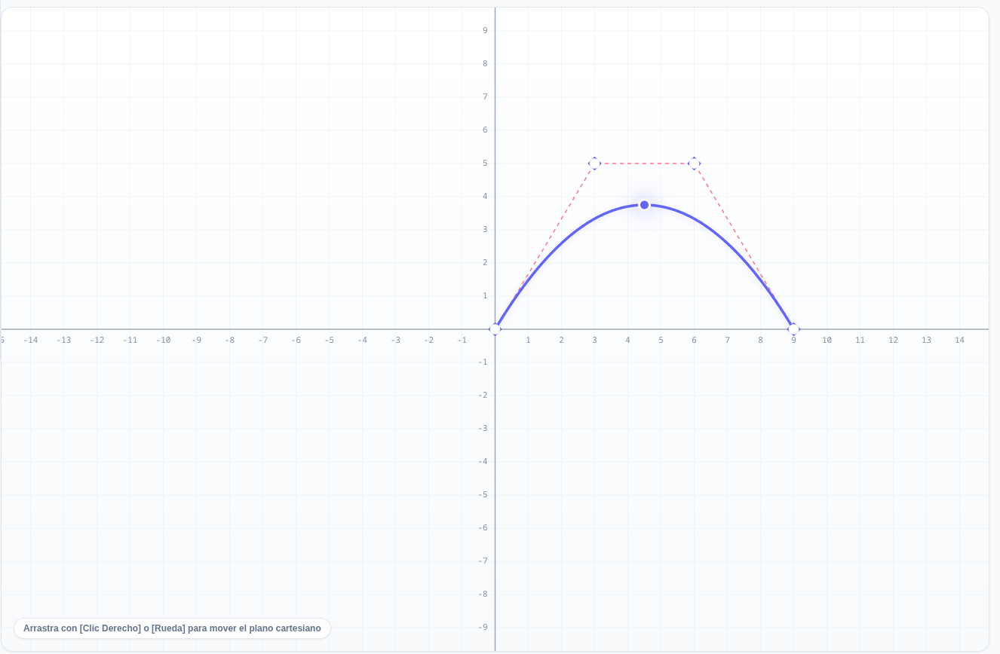
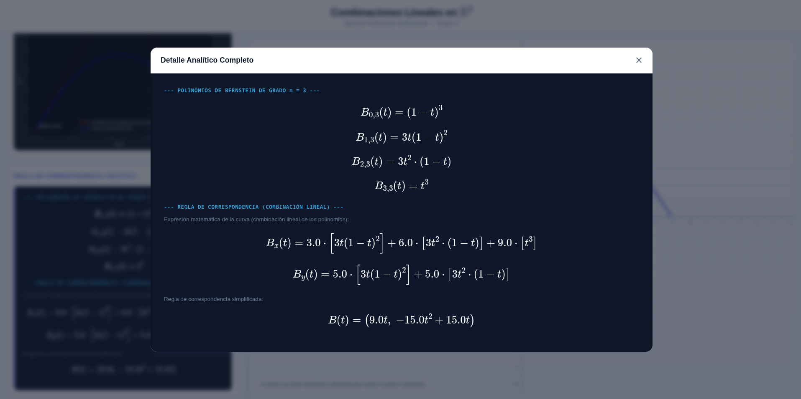
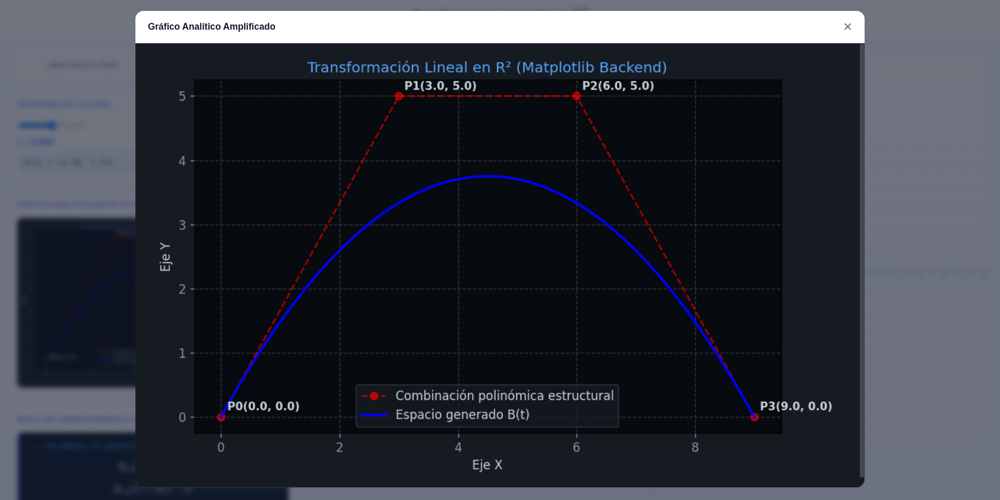

# Combinaciones Lineales en $\mathbb{R}^2$ mediante Polinomios de Bernstein

<div align="center">


</div>

## Descripción

Aplicación web interactiva desarrollada para el estudio de combinaciones lineales en $\mathbb{R}^2$ utilizando polinomios de Bernstein. El sistema permite definir puntos de control sobre un plano cartesiano, generar curvas paramétricas asociadas y obtener sus expresiones algebraicas expandidas mediante procesamiento simbólico.

La solución integra una interfaz gráfica interactiva con un backend científico capaz de calcular, simplificar y representar matemáticamente las curvas generadas en tiempo real.

---

## Enlaces

* **Aplicación desplegada:** https://berstein-project.vercel.app/
* **Repositorio:** https://github.com/bktmatjv/Berstein-Project
* **Cuaderno de experimentación:** https://colab.research.google.com/drive/143v2Snk3nfni_75loirTV2I3OMVnpND0
* **Diagrama de flujo:** https://canva.link/099tqvqfw8oyzye

---

## Capturas de Pantalla

### Plano Cartesiano Interactivo


<p align="center">
  
</p>


### Expansión Simbólica de la Curva

<p align="center">
  
</p>


### Visualización Analítica


<p align="center">
  
</p>


---

## Funcionalidades

* Visualización de un plano cartesiano interactivo basado en SVG.
* Creación y edición dinámica de puntos de control.
* Soporte para desplazamiento y escalado del plano (*pan* y *zoom*).
* Generación automática de curvas mediante polinomios de Bernstein.
* Procesamiento simbólico de expresiones matemáticas.
* Expansión y simplificación algebraica utilizando SymPy.
* Generación de representaciones gráficas con Matplotlib.
* Renderizado de expresiones matemáticas mediante MathJax.
* Comunicación cliente-servidor mediante API REST desarrollada con FastAPI.

---

## Arquitectura del Sistema

### Frontend

* HTML5
* CSS3
* JavaScript
* SVG
* MathJax

### Backend

* Python 3
* FastAPI
* SymPy
* NumPy
* Matplotlib

---

## Estructura del Proyecto

```text
.
├── backend
│   ├── main.py
│   └── requirements.txt
├── frontend
│   ├── app.html
│   ├── app.js
│   ├── index.html
│   └── styles.css
├── images
│   ├── expresion.png
│   ├── matplotlib.png 
│   └── plano.png
└── README.md
```

---

## Fundamento Matemático

Los polinomios de Bernstein de grado $n$ se definen como

$$
B_{i,n}(t)=\binom{n}{i}t^i(1-t)^{n-i},
$$

donde $0 \leq t \leq 1$.

A partir de un conjunto de puntos de control $P_0, P_1, \ldots, P_n$, la curva paramétrica se construye mediante

$$
C(t)=\sum_{i=0}^{n} P_i B_{i,n}(t).
$$

Los polinomios de Bernstein satisfacen las propiedades de partición de la unidad y positividad, garantizando que la curva permanezca dentro de la envolvente convexa definida por los puntos de control.

Estas propiedades constituyen la base matemática de las curvas de Bézier empleadas en gráficos por computadora, modelado geométrico y sistemas CAD.

---

## Integrantes

**Grupo 2 — Universidad Peruana de Ciencias Aplicadas (UPC)**

| Integrante                         |
| ---------------------------------- |
| Matias Javier Del Castillo Mendoza |
| Vanessa Jazmin                     |
| Vivianne Fátima                    |
| Nicole Abigail                     |

---

## Contexto Académico

Proyecto desarrollado para el curso de Álgebra Lineal Aplicada de la Universidad Peruana de Ciencias Aplicadas (UPC), orientado a la aplicación de combinaciones lineales, interpolación polinómica y representación paramétrica de curvas.
